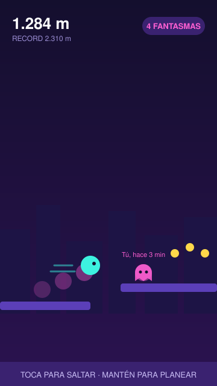
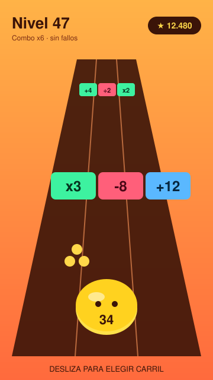
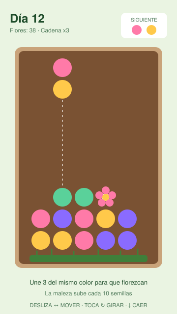
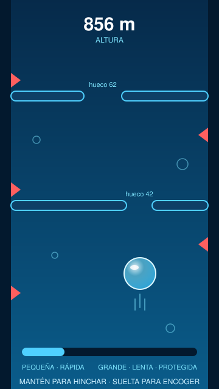
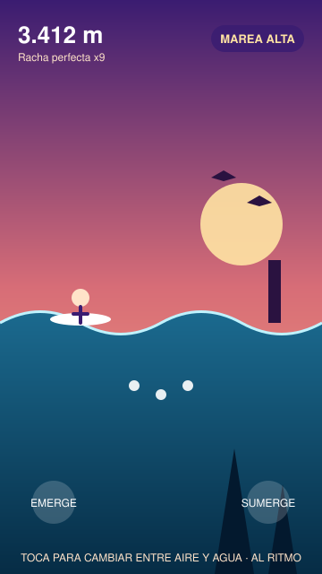

# Videojuego endless: 5 ideas con mockups

Cinco propuestas de juego endless para móvil. Todas se juegan con una mano, tienen partidas de menos de 2 minutos y se entienden en 5 segundos. Cada una tiene un gancho propio que explica por qué se repite la partida.

Los mockups están en `mockups/` (SVG, formato vertical 360×640). Puedes abrir `index.html` para verlos todos juntos.

| # | Juego | Género | Control | Gancho adictivo |
|---|-------|--------|---------|-----------------|
| 1 | Fantasma de Ayer | Runner de plataformas | 1 toque | Tus partidas anteriores se convierten en enemigos |
| 2 | Merge Rush | Runner + fusión | Deslizar | Números que crecen y combos |
| 3 | Jardín en Caída | Puzzle de caída | Deslizar + toque | Cadenas de flores y maleza que sube |
| 4 | Burbuja Cero | Ascenso de reflejos | Mantener / soltar | Dilema entre tamaño y velocidad |
| 5 | Marea Alta | Rítmico | 1 toque | Racha perfecta al ritmo de la música |

---

## 1. Fantasma de Ayer

**Idea:** un runner de plataformas donde cada partida deja un fantasma que repite exactamente tu recorrido. En la siguiente partida ese fantasma aparece como obstáculo. Tu yo del pasado es el enemigo.

**Cómo se juega:** tocas para saltar y mantienes para planear. Recoges monedas y esquivas a tus fantasmas anteriores. Solo se guardan los 5 últimos, así que la dificultad se ajusta sola a tu forma de jugar.

**Por qué engancha:**
- "Una más" porque quieres superar a tu propio fantasma.
- Cada partida es distinta porque los obstáculos dependen de lo que hiciste antes.
- Se puede compartir: envías tu fantasma a un amigo y él tiene que esquivarlo.

**Progresión:** aspectos para el corredor y para los fantasmas, y un modo "Fantasma del amigo" con ranking semanal.

**Estilo visual:** neón sobre fondo morado oscuro, silueta de ciudad, fantasmas translúcidos en rosa.

---

## 2. Merge Rush

**Idea:** corres por una pista con una gelatina que lleva un número. En cada fila eliges entre tres puertas (x3, -8, +12) y el número crece. Al final del tramo chocas contra un jefe con otro número: si eres mayor, ganas y sigues.

**Cómo se juega:** deslizas a izquierda o derecha para elegir carril. Tienes que hacer cuentas rápidas mientras corres. Un combo de puertas buenas seguidas multiplica los puntos.

**Por qué engancha:**
- Se ve crecer la gelatina, y eso da satisfacción inmediata.
- Cada puerta es una decisión de riesgo, no solo de reflejos.
- Las partidas son muy cortas, ideales para sesiones de un minuto.

**Progresión:** desbloqueas gelatinas con formas y caras distintas, y pistas temáticas (cocina, espacio, océano).

**Estilo visual:** naranja cálido, formas redondeadas, números grandes y legibles.

---

## 3. Jardín en Caída

**Idea:** un puzzle de caída relajante. Caen parejas de semillas de colores. Al unir tres del mismo color, florecen y desaparecen. Desde abajo sube maleza que ocupa el tablero.

**Cómo se juega:** mueves y giras las semillas, y las dejas caer. Las flores en cadena limpian varias filas a la vez. Cada 10 semillas la maleza sube una fila, y solo se elimina florando junto a ella.

**Por qué engancha:**
- Mezcla lo relajante de un jardín con la tensión de una pila que crece.
- Las cadenas dan momentos de "wow" que se quieren repetir.
- Cada partida termina por acumulación, no por un error único, así que se siente justo.

**Progresión:** tu jardín se guarda y se llena de las flores que has conseguido. Hay eventos por estación.

**Estilo visual:** verdes suaves y colores pastel, estilo cozy.

---

## 4. Burbuja Cero

**Idea:** eres una burbuja que sube por un pozo lleno de pinchos y barreras con huecos. Mantienes el dedo para hincharla y sueltas para encogerla.

**Cómo se juega:** una burbuja pequeña es rápida y cabe por huecos estrechos, pero un solo roce la revienta. Una grande es lenta y aguanta un golpe, pero no cabe por todos los huecos. Tienes que decidir el tamaño en cada tramo.

**Por qué engancha:**
- Un solo dedo, pero con una decisión constante.
- La tensión sube de forma natural con la altura.
- Es fácil de aprender y difícil de dominar.

**Progresión:** distintas burbujas con habilidades (jabón, gas, gota de aceite) y zonas con corrientes.

**Estilo visual:** azules profundos, brillos translúcidos, sensación de agua.

---

## 5. Marea Alta

**Idea:** un surfista que cambia entre la superficie y el fondo al ritmo de la música. Arriba hay aves y postes; abajo hay rocas y perlas.

**Cómo se juega:** tocas en el momento justo para emerger o sumergirte. Cada toque en ritmo suma a la racha perfecta y acelera la música.

**Por qué engancha:**
- El ritmo hace que jugar sea casi hipnótico.
- La música responde a tu racha y cambia de intensidad.
- Los atardeceres y las canciones dan variedad sin cambiar la mecánica.

**Progresión:** playas nuevas con su propia banda sonora y aspectos para el surfista.

**Estilo visual:** atardecer en degradado, agua oscura, siluetas.

---

## Cuál elegir

Mi recomendación para empezar es **Fantasma de Ayer**. Es la idea más nueva, se prototipa rápido (solo necesita guardar la ruta del jugador) y tiene un gancho que se puede compartir con amigos. **Burbuja Cero** es la segunda opción si quieres algo aún más simple de construir.

## Siguientes pasos

1. Elegir una idea.
2. Prototipo jugable en HTML/JS o Godot en unos días.
3. Probarlo con 5 personas y medir cuántas veces dicen "una más".
4. Añadir progresión, sonido y monetización (anuncios opcionales y aspectos).
